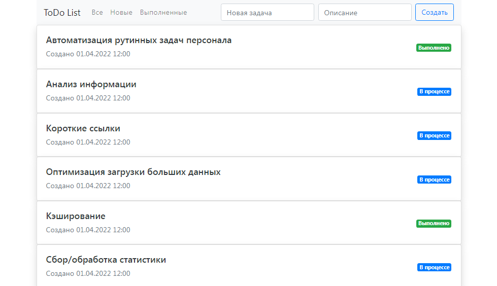
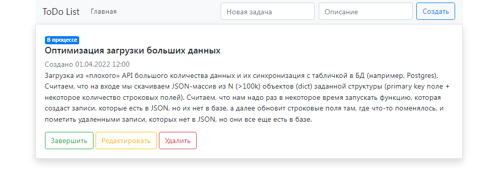
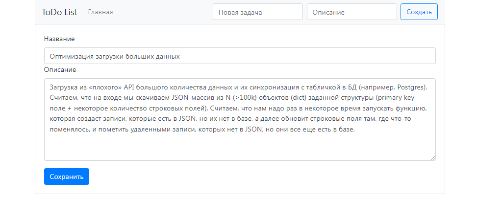

# ToDo List

Проект Todo List предоставляет собой простой функционал создавать цели или задачи, и изменять статус их выполнения.

Имеется возможность редактирования

Используемы технологии:
Spring Boot
Hibernate
PostgeSQL
Liquibase
Bootstrap
Thymeleaf
Maven